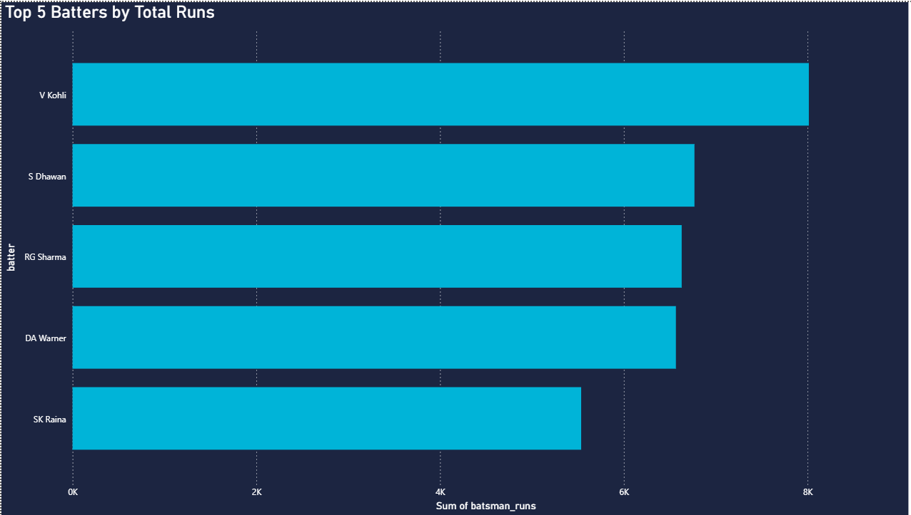
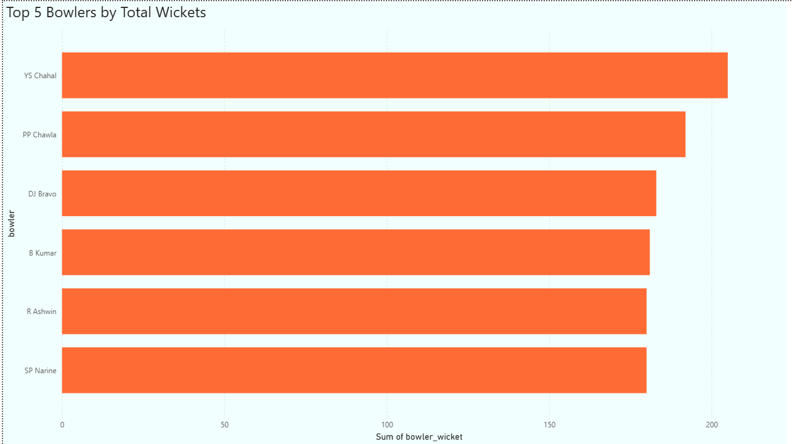

# 🏏 IPL Historical Data Analytics (2008 – 2024)

An end-to-end data engineering and visualization project that aggregates 17 seasons of historical Indian Premier League (IPL) match records. This project builds a comprehensive data pipeline in Python to resolve legacy franchise renaming inconsistencies and highlights the tournament's all-time statistical leaders in an interactive Power BI report.

---

## 📊 Executive Dashboard Previews

*Figure 1: All-Time Top 5 Batsmen Leaderboard.*


*Figure 2: All-Time Top 5 Bowlers Leaderboard.*

---

## 📁 Repository Structure
```text
data_analysis/
├── dashboard/                # Master Power BI workspace deployment file
│   └── ipl_power_bi.pbix
├── data/
│   ├── raw/                  # Source CSV datasets downloaded from Kaggle (2008-2024)
│   │   ├── deliveries.csv
│   │   └── matches.csv
│   └── processed/            # Structurally verified sample data exported from Python
│       ├── cleaned_deliveries.csv
│       └── cleaned_matches.csv
├── images/                   # High-resolution application screenshots for UI reference
│   ├── batter_analysis_image.png
│   └── bowler_analysis_image.png
├── notebooks/                # Jupyter Notebook housing all data engineering logic
│   └── data_cleaning_and_analysis.ipynb
└── README.md                 # Complete project report and documentation
```

---

## ⚙️ Data Engineering & Cleaning Pipeline (Python)
The historical nature of this 17-season dataset (covering every match from 2008 up to the 2024 IPL Final) introduced significant structural inconsistencies and broken references over time. A strict preprocessing pipeline was built in Python using **Pandas** to ensure absolute data integrity:

1. **Null Value & Duplicate Auditing:** Inspected both datasets for missing entries and duplicate tracking lines, cleaning the records to avoid double-counting match statistics.
2. **Multi-Table Team Name Standardization:** Conducted high-level validation on unique franchise identifiers using `.unique()` arrays to catch legacy team renaming anomalies across 17 years of history. 
   * *Example:* Merged old team references like **Delhi Daredevils** into **Delhi Capitals**, and **Kings XI Punjab** into **Punjab Kings**.
3. **Cross-Table Verification:** Verified that the unique team names in the `deliveries` table matched the names in the master `matches` ledger perfectly, preventing broken data links inside the visualization model.

---

## 📊 Power BI Visualization & Reports
Once the clean datasets were exported from Python, they were loaded into **Power BI** to present the definitive tournament leaders across the entire history of the league:

* **All-Time Top 5 Batsmen Analytics:** Structured a leaderboard visual capturing the absolute highest run-getters in IPL history from 2008 to 2024.
* **All-Time Top 5 Bowlers Analytics:** Designed a performance chart isolating the absolute highest wicket-taking bowlers in IPL history from 2008 to 2024.

---

## 🔧 Local Execution Instructions
1. **Clone the Repository:** Pull this archive to your local desktop workstation.
2. **Review Engineering Code:** Launch the notebook located inside `/notebooks` to view the Python cleaning sequence and data transformation verification logs.
3. **Launch the Dashboard:** Run the `.pbix` application inside `/dashboard` using **Power BI Desktop** to view the report layouts.
